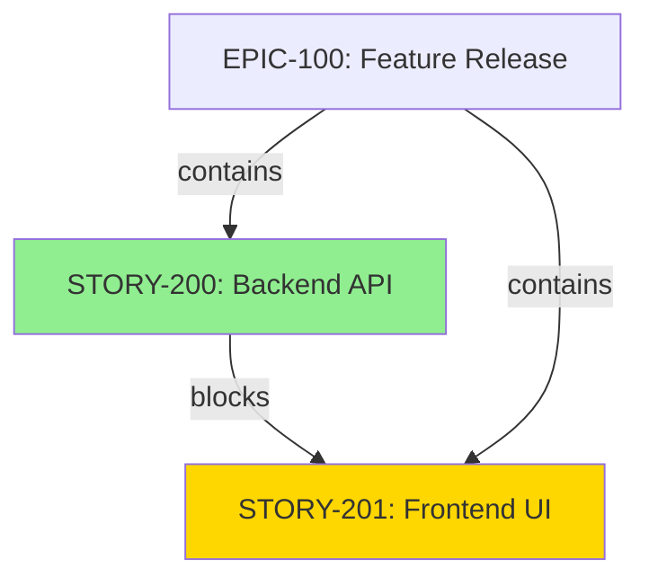

# JIRA Issue Relationships Best Practices Guide

Comprehensive guide to managing issue relationships, dependencies, blockers, and cloning in JIRA for effective project coordination.

---

## Table of Contents

1. [Link Types Reference](#link-types-reference)
2. [When to Use Each Link Type](#when-to-use-each-link-type)
3. [Dependency Management Strategies](#dependency-management-strategies)
4. [Blocker Chain Analysis](#blocker-chain-analysis)
5. [Parent-Child Relationships](#parent-child-relationships)
6. [Cross-Project Linking](#cross-project-linking)
7. [Issue Cloning Strategies](#issue-cloning-strategies)
8. [Visualizing Dependencies](#visualizing-dependencies)
9. [Managing Circular Dependencies](#managing-circular-dependencies)
10. [Common Pitfalls](#common-pitfalls)
11. [Quick Reference Card](#quick-reference-card)

---

## Link Types Reference

### Standard JIRA Link Types

| Link Type | Outward Description | Inward Description | Use Case |
|-----------|--------------------|--------------------|----------|
| **Blocks** | blocks | is blocked by | Sequential dependencies where one task must complete before another starts |
| **Cloners** | clones | is cloned by | Duplicating issues with relationships intact |
| **Duplicate** | duplicates | is duplicated by | Marking redundant/identical issues |
| **Relates** | relates to | relates to | General association without dependency |
| **Caused by** | causes | is caused by | Bug/defect root cause tracking |
| **Parent/Child** | contains | is part of | Hierarchical decomposition (some instances) |

### Understanding Link Direction

**Critical Concept:** JIRA link semantics can be confusing. When viewing links for an issue:

```
Issue A blocks Issue B:
- A is the "outward" issue (on the "blocks" side)
- B is the "inward" issue (on the "is blocked by" side)

When fetching links for Issue B:
- The link shows outwardIssue=A (A blocks B)
- B itself is the inward issue (implied)
```

**Practical Impact:**
- To find issues blocking you: look for `outwardIssue` in "Blocks" links
- To find issues you block: look for `inwardIssue` in "Blocks" links

---

## When to Use Each Link Type

### Blocks / Is Blocked By

**Use when:**
- Task A must finish before Task B can start (Finish-to-Start dependency)
- There's a hard technical dependency (e.g., API must exist before integration)
- Sequential workflow steps that cannot overlap

**Example:**
```bash
# Backend API must be ready before frontend integration
python link_issue.py BACKEND-123 --blocks FRONTEND-456

# Database migration must complete before feature deployment
python link_issue.py DB-789 --blocks DEPLOY-101
```

**Don't use for:**
- Soft dependencies that are just "nice to have"
- General related work that could happen in parallel
- Team coordination that could be resolved with communication

### Duplicates / Is Duplicated By

**Use when:**
- Two issues describe the exact same problem/feature
- You want to consolidate reporting to avoid double-counting
- Redirecting stakeholders to the canonical issue

**Best practices:**
```bash
# Mark the newer/less detailed issue as the duplicate
python link_issue.py PROJ-456 --duplicates PROJ-123

# Always add a comment explaining why it's a duplicate
python link_issue.py PROJ-456 --duplicates PROJ-123 --comment "Same login timeout issue. See PROJ-123 for full details."
```

**After linking:**
- Close/resolve the duplicate issue
- Move watchers to the primary issue
- Update the duplicate's description to point to primary

### Relates To

**Use when:**
- Issues share common themes but no hard dependency
- Cross-team awareness needed
- Similar technical areas that might inform each other

**Example:**
```bash
# Related refactoring efforts
python link_issue.py AUTH-100 --relates-to AUTH-200

# Similar bugs in different components
python link_issue.py MOBILE-50 --relates-to WEB-75
```

**Don't overuse:**
- Too many "relates" links dilute their value
- Maximum 5-7 related links per issue for clarity
- Use labels or components for broader grouping

### Clones / Is Cloned By

**Use when:**
- Creating a similar issue for a different context (e.g., other platform)
- Replicating a workflow for a new sprint/release
- Maintaining traceability between original and copy

**Example:**
```bash
# Clone feature for different platform
python clone_issue.py IOS-100 --to-project ANDROID

# Clone epic structure for next release
python clone_issue.py EPIC-200 --include-subtasks
```

---

## Dependency Management Strategies

### Dependency Type Framework

Organize dependencies into three categories:

| Type | Definition | Link Strategy | Example |
|------|------------|---------------|---------|
| **Knowledge** | Information needed to proceed | Use "Relates to" or "Blocks" if critical | Need design specs before implementation |
| **Process** | Sequential workflow requirement | Use "Blocks" | Code review before deployment |
| **Resource** | Shared resource/team availability | Use "Blocks" with labels | DBA availability for migration |

### Categorizing Your Dependencies

**Knowledge Dependencies:**
```bash
# Design must be reviewed before implementation
python link_issue.py DESIGN-50 --blocks DEV-100
python link_issue.py DEV-100 --is-blocked-by DESIGN-50  # Alternative syntax
```

**Process Dependencies:**
```bash
# Testing must pass before release
python link_issue.py QA-200 --blocks RELEASE-300
```

**Resource Dependencies:**
```bash
# Bulk link all issues dependent on DBA availability
python bulk_link.py --jql "labels = needs-dba AND sprint = 42" --is-blocked-by DBA-TASK
```

### Dependency Hygiene

**Weekly Review Checklist:**
- [ ] Review all blocker chains for unresolved dependencies
- [ ] Update or remove stale "Blocks" links where work completed
- [ ] Escalate blockers older than 5 days
- [ ] Verify blocked issues are actually waiting (not started prematurely)

**Command for finding stale blockers:**
```bash
# Find your blocked issues
python get_blockers.py PROJ-123 --recursive --output tree

# Generate project-wide blocker stats
python link_stats.py --project PROJ --output json
```

### Important Limitation

**Critical:** JIRA issue links are labels only. They do NOT enforce workflow rules.

```
Even if PROJ-100 blocks PROJ-200:
- PROJ-200 can still transition to "In Progress"
- PROJ-200 can still be marked "Done"
- No automatic validation prevents this
```

**Solution:** Combine issue links with:
- Workflow validators (requires JIRA admin)
- Automation rules to flag violations
- Team discipline and code reviews
- Regular blocker audits

---

## Blocker Chain Analysis

### Finding Critical Paths

**Single-level blockers:**
```bash
# What's blocking this issue?
python get_blockers.py PROJ-123

# What issues does this block?
python get_blockers.py PROJ-123 --direction outward
```

**Recursive blocker chains:**
```bash
# Full dependency tree (unlimited depth)
python get_blockers.py PROJ-123 --recursive --output tree

# Limit depth to avoid overwhelming output
python get_blockers.py PROJ-123 --recursive --depth 3
```

### Example Blocker Tree Output

```
Issues blocking PROJ-500:

├── INFRA-100 [In Progress] Infrastructure upgrade required
│   ├── INFRA-50 [In Progress] Security audit
│   └── INFRA-75 [Done] Hardware procurement ✓
└── API-200 [To Do] REST API v2 migration
    └── API-150 [In Progress] API design review

Total: 4 blocker(s) (1 resolved, 3 unresolved)
```

### Blocker Chain Strategies

**Daily Standup Focus:**
```bash
# Show blockers for current sprint issues
python get_blockers.py SPRINT-ISSUE --recursive

# Prioritize:
# 1. Blockers with no sub-blockers (leaves) - work these first
# 2. Blockers blocking multiple issues (high impact)
# 3. Blockers with long chains (critical path)
```

**Sprint Planning:**
```bash
# Before committing to a story, check its blocker chain
python get_blockers.py STORY-100 --recursive --depth 5

# If chain depth > 2, consider:
# - Deferring to later sprint
# - Breaking dependencies
# - Parallelizing work
```

**Release Readiness:**
```bash
# Find all unresolved blockers for release
python link_stats.py --jql "fixVersion = 'v2.0' AND status != Done"

# Generate dependency graph for release scope
python get_dependencies.py EPIC-RELEASE --output mermaid > release-deps.md
```

---

## Parent-Child Relationships

### Epic → Story → Subtask Hierarchy

**Standard Hierarchy:**
```
Epic (EPIC-100)
├── Story (STORY-200)
│   ├── Subtask (STORY-200.1)
│   └── Subtask (STORY-200.2)
└── Story (STORY-201)
    └── Subtask (STORY-201.1)
```

**Not managed by issue links:**
- Epics link to stories via custom field (typically `customfield_10014`)
- Subtasks have parent via `parent` field (not issue links)

**Use issue links for:**
- Cross-epic dependencies: `python link_issue.py EPIC-A --blocks EPIC-B`
- Story-to-story within epic: Use "Relates to" if needed
- Alternative hierarchies (some orgs use "Parent/Child" link type)

### Linking Strategy by Hierarchy Level

| Level | Internal Links | External Links |
|-------|---------------|----------------|
| **Epic** | Rarely link epics together | Use "Blocks" for epic-level dependencies across teams |
| **Story** | Use "Relates to" for stories in same epic | Use "Blocks" for cross-epic story dependencies |
| **Subtask** | Avoid linking subtasks | Use "Blocks" only for technical dependencies |

### Anti-Pattern: Over-Linking Within Epics

**Bad:**
```bash
# Don't link every story to every other story in an epic
python link_issue.py STORY-1 --relates-to STORY-2
python link_issue.py STORY-2 --relates-to STORY-3
python link_issue.py STORY-3 --relates-to STORY-4
# Creates noise, no value - epic already groups them
```

**Good:**
```bash
# Only link when there's a real dependency
python link_issue.py STORY-DB-SCHEMA --blocks STORY-API-IMPL
python link_issue.py STORY-API-IMPL --blocks STORY-FRONTEND
```

---

## Cross-Project Linking

### When to Link Across Projects

**Valid Scenarios:**
- Team A building API that Team B consumes
- Infrastructure team unblocking feature teams
- Platform migrations affecting multiple products
- Shared services with multiple consumers

**Example:**
```bash
# Platform team provides authentication for multiple products
python link_issue.py PLATFORM-AUTH --blocks PRODUCTA-LOGIN
python link_issue.py PLATFORM-AUTH --blocks PRODUCTB-SIGNIN
python link_issue.py PLATFORM-AUTH --blocks PRODUCTC-AUTH
```

### Cross-Project Best Practices

**1. Use bulk linking for shared dependencies:**
```bash
# All teams waiting on platform upgrade
python bulk_link.py \
  --jql "project IN (TEAM-A, TEAM-B, TEAM-C) AND labels = needs-platform-v2" \
  --is-blocked-by PLATFORM-500
```

**2. Document cross-project dependencies in issue description:**
```markdown
## Dependencies
- Blocked by: PLATFORM-500 (Authentication service upgrade)
- Impact: Cannot implement SSO until PLATFORM-500 is Done
- Contact: @platform-team in Slack
```

**3. Watch blocker chains crossing project boundaries:**
```bash
# Identify cross-project dependency chains
python get_blockers.py YOUR-ISSUE --recursive --output tree

# Look for issues in other projects in the chain
```

**4. Coordinate release schedules:**
- If ProjectA-123 blocks ProjectB-456, ensure:
  - ProjectA's sprint planning includes ProjectA-123
  - ProjectB team is notified when ProjectA-123 completes
  - Version alignment for integrated features

### Cross-Project Anti-Patterns

| Anti-Pattern | Problem | Solution |
|--------------|---------|----------|
| **Duplicate tracking** | Both teams create issues for same work | Use single issue, add both projects as watchers |
| **Phantom dependencies** | Linking issues that could be parallel | Challenge if dependency is real; parallelize if possible |
| **Abandoned blockers** | Blocker team deprioritizes, blocks never removed | Weekly cross-team dependency review |
| **No ownership** | Cross-project link with no clear owner | Assign blocker to specific person, set due date |

---

## Issue Cloning Strategies

### When to Clone Issues

**Good Use Cases:**
| Scenario | Strategy | Command |
|----------|----------|---------|
| **Multi-platform features** | Clone per platform | `clone_issue.py IOS-100 --to-project ANDROID` |
| **Recurring workflows** | Clone as template | `clone_issue.py ONBOARDING-EPIC --include-subtasks` |
| **Environment promotion** | Clone dev → stage → prod | `clone_issue.py DEV-500 --to-project STAGING` |
| **Team replication** | Clone for other squad | `clone_issue.py TEAM-A-100 --to-project TEAM-B` |

**Bad Use Cases:**
- Cloning instead of fixing duplicate issue tracking
- Cloning to "copy" work that should be done once
- Cloning to artificially inflate team metrics

### Clone With Links vs Without

**Clone with links (--include-links):**
```bash
python clone_issue.py PROJ-100 --include-links
```

**When to use:**
- Preserving dependency structure across environments
- Replicating complex feature with all relationships
- Creating parallel implementation with same structure

**Caution:** May create cross-project link tangles if not careful

**Clone without links (default):**
```bash
python clone_issue.py PROJ-100
```

**When to use:**
- Fresh start without historical dependencies
- Cloning to different context where old links don't apply
- Simplifying issue structure

### Clone With Subtasks

**Full hierarchy clone:**
```bash
# Clone entire epic structure
python clone_issue.py EPIC-500 --include-subtasks --include-links
```

**Limitations:**
- Native JIRA only clones one level
- For multi-level hierarchies (Epic → Story → Subtask):
  - Use third-party apps (Deep Clone, Elements Copy & Sync)
  - Or script multiple clone operations

**Automated multi-level cloning:**
```bash
# Clone epic
NEW_EPIC=$(python clone_issue.py EPIC-500 | grep -o 'PROJ-[0-9]*')

# Clone each story under epic
for story in STORY-100 STORY-101 STORY-102; do
  python clone_issue.py $story --include-subtasks
  # Manually re-link to NEW_EPIC via API or UI
done
```

### Cloning Best Practices

**1. Update cloned issue summaries:**
```bash
# Clone with custom summary
python clone_issue.py PROJ-100 --summary "[CLONE] Original feature for Android"
```

**2. Remove irrelevant fields after cloning:**
- Clear sprint assignment (will be planned separately)
- Reset story points (re-estimate for new context)
- Update assignee (may be different team)
- Clear time tracking (clone starts fresh)

**3. Maintain clone links for traceability:**
```bash
# Default behavior creates "Cloners" link
python clone_issue.py PROJ-100
# PROJ-100 ← "is cloned by" → PROJ-200
```

**Benefits:**
- Find all variants of a feature
- Share learning across clones
- Track which implementations are based on a template

**4. Use cloning for templates, not workarounds:**
- Do: Clone sprint planning template epic
- Don't: Clone issue to bypass workflow restrictions

---

## Visualizing Dependencies

### Text-Based Visualization

**Tree view for blocker chains:**
```bash
python get_blockers.py PROJ-500 --recursive --output tree
```

**Output:**
```
Issues blocking PROJ-500:
├── API-100 [In Progress] REST API implementation
│   └── API-50 [Done] API specification ✓
└── DB-200 [To Do] Database schema migration
    ├── DB-150 [In Progress] Schema design
    └── DB-175 [To Do] Migration script

Total: 4 blocker(s) (1 resolved, 3 unresolved)
⚠️ Circular dependency detected!
```

### Graph Formats

The `get_dependencies.py` script supports multiple diagram formats:

| Format | Best For | Rendering |
|--------|----------|-----------|
| **Mermaid** | GitHub/GitLab docs, wiki | Renders in markdown viewers |
| **DOT (Graphviz)** | High-quality PDFs, complex graphs | `dot -Tpng deps.dot -o deps.png` |
| **PlantUML** | Architecture documentation | PlantUML server or CLI |
| **D2 (Terrastruct)** | Modern diagramming | `d2 deps.d2 deps.svg` |

### Mermaid Example

```bash
python get_dependencies.py EPIC-100 --output mermaid > deps.md
```

**Generated diagram:**


**Use in:**
- Sprint review presentations
- Stakeholder updates
- Technical design documents
- Release planning docs

### Graphviz Example

```bash
python get_dependencies.py EPIC-100 --output dot > deps.dot
dot -Tpng deps.dot -o deps.png
dot -Tsvg deps.dot -o deps.svg
```

**Advanced options:**
- Horizontal layout: `dot -Grankdir=LR -Tpng deps.dot -o deps.png`
- Different algorithm: `neato -Tpng deps.dot -o deps.png` (force-directed)

### Visualization Best Practices

**1. Limit scope for clarity:**
```bash
# Too broad - overwhelming
python get_dependencies.py PROJECT-ROOT --output mermaid

# Better - focused on current sprint
python get_dependencies.py SPRINT-EPIC --output mermaid
```

**2. Use color coding:**
- Green: Done/Resolved
- Yellow: In Progress
- Red: Blocked/At Risk
- White/Gray: To Do/Open

**3. Update regularly:**
```bash
# Weekly update of release dependency graph
python get_dependencies.py RELEASE-EPIC --output dot > weekly-deps.dot
dot -Tpng weekly-deps.dot -o release-deps-$(date +%Y%m%d).png
```

**4. Share with stakeholders:**
- Add to sprint review slides
- Include in release notes
- Attach to confluence pages
- Reference in stand-ups

---

## Managing Circular Dependencies

### What is a Circular Dependency?

**Definition:** Issue A blocks Issue B, Issue B blocks Issue C, Issue C blocks Issue A.

```
A → blocks → B → blocks → C → blocks → A
```

**Problem:** No issue can start because each waits for another.

### Detecting Circular Dependencies

**Automated detection:**
```bash
python get_blockers.py PROJ-100 --recursive --output tree
```

**Output when circular:**
```
Issues blocking PROJ-100:
├── PROJ-200 [To Do] Feature B
│   └── PROJ-300 [To Do] Feature C
│       └── PROJ-100 [CIRCULAR]

Total: 2 blocker(s) (0 resolved, 2 unresolved)
⚠️ Circular dependency detected!
```

### Breaking Circular Dependencies

**Strategy 1: Find the False Dependency**

Often one link in the chain is not a hard dependency:

```bash
# Review each link:
python get_links.py PROJ-100
python get_links.py PROJ-200
python get_links.py PROJ-300

# Remove the weakest link
python unlink_issue.py PROJ-300 --from PROJ-100
```

**Strategy 2: Insert an Intermediary**

Create a new issue that breaks the cycle:

```
Before: A ↔ B (circular)

After:
A → A-INTERFACE ← B
(Both A and B implement the interface, no cycle)
```

**Example:**
```bash
# Create interface/contract issue
python create_issue.py --summary "API Contract Definition" --type Task

# Relink
python unlink_issue.py PROJ-A --from PROJ-B
python link_issue.py PROJ-A --is-blocked-by API-CONTRACT
python link_issue.py PROJ-B --is-blocked-by API-CONTRACT
```

**Strategy 3: Parallelize Work**

If both can start with partial information:

```bash
# Change from "blocks" to "relates to"
python unlink_issue.py PROJ-A --from PROJ-B
python link_issue.py PROJ-A --relates-to PROJ-B
```

**Strategy 4: Timebox and Re-evaluate**

Sometimes dependencies become clear only during work:

```bash
# Remove blocker, add label for follow-up
python unlink_issue.py PROJ-A --from PROJ-B
# Add label "needs-sync-with-PROJ-B" to PROJ-A
```

### Preventing Circular Dependencies

**1. Design dependencies as DAG (Directed Acyclic Graph):**
- Dependencies should flow in one direction
- No cycles allowed
- Usually flows: Foundation → Features → Integration → Deployment

**2. Review dependencies during sprint planning:**
```bash
# Before committing issues to sprint, check for cycles
python get_blockers.py CANDIDATE-ISSUE --recursive

# If circular warning appears, resolve before sprint starts
```

**3. Link direction conventions:**
- Lower-level components block higher-level (DB blocks API blocks UI)
- Earlier phases block later phases (Design blocks Dev blocks Test)
- Infrastructure blocks features

**4. Regular dependency audits:**
```bash
# Monthly: Review all blocker links
python link_stats.py --project PROJ --output json > monthly-link-audit.json

# Look for issues with both inward and outward "Blocks" links
# These are candidates for circular dependencies
```

---

## Common Pitfalls

### Anti-Patterns to Avoid

| Pitfall | Problem | Solution |
|---------|---------|----------|
| **Link Inflation** | Linking everything "just in case" | Only link when there's a real dependency or need for traceability |
| **Wrong Link Type** | Using "Blocks" for everything | Use appropriate type: Blocks (dependency), Relates (FYI), Duplicates (same issue) |
| **Phantom Blockers** | Marking issues blocked when work could proceed | Challenge if blocker is real; start work if possible |
| **Stale Links** | Links to closed/resolved issues never removed | Weekly link hygiene: remove obsolete links |
| **Link Chaos** | Global link types causing cross-project confusion | Standardize link type usage via team guidelines |
| **Duplicate Links** | Multiple links between same two issues | Check existing links before adding: `get_links.py PROJ-123` |
| **Self-Links** | Linking issue to itself | Validation prevents this in scripts, but possible via UI |
| **Bi-directional Redundancy** | Both "A blocks B" and "B is blocked by A" | JIRA represents as single link; don't create both |

### Link Hygiene Checklist

**Daily (Team Ritual):**
- [ ] Update blocker status in stand-up
- [ ] Remove "Blocks" links when blocker resolved
- [ ] Flag blockers older than 3 days for escalation

**Weekly (Backlog Grooming):**
- [ ] Review all open blockers
- [ ] Remove stale "Relates to" links (>30 days, both issues closed)
- [ ] Consolidate duplicate issues
- [ ] Verify cross-project links are still valid

**Monthly (Dependency Audit):**
- [ ] Generate link statistics: `link_stats.py --project PROJ`
- [ ] Review issues with >10 links (likely over-linked)
- [ ] Clean up orphaned link types (if using custom types)
- [ ] Document team link type standards

### Red Flags

**In an Issue:**
- More than 10 outbound links (too connected, hard to understand)
- "Blocks" link older than 14 days with no update (stale blocker)
- Mix of "Blocks" and "Relates" to same issue (unclear relationship)
- Link cycle detected (circular dependency)

**In a Project:**
- >30% of issues have no links (lack of dependency tracking)
- >50% of issues have "Blocks" links (overuse of blocking)
- Inconsistent link type usage (some say "Blocks", others "depends on")
- Many closed issues still marked as blockers

**Commands to detect:**
```bash
# Find issues with too many links
python link_stats.py --project PROJ --top 20

# Find orphaned issues (no links)
python link_stats.py --project PROJ | grep "0 links"

# Find circular dependencies
python get_blockers.py SUSPICIOUS-ISSUE --recursive
```

---

## Quick Reference Card

### Essential Commands

```bash
# View all link types in your JIRA instance
python get_link_types.py

# Create a blocker relationship
python link_issue.py BACKEND-123 --blocks FRONTEND-456

# Create bi-directional "relates" link
python link_issue.py PROJ-100 --relates-to PROJ-200

# Mark as duplicate (and close the duplicate)
python link_issue.py PROJ-NEW --duplicates PROJ-ORIGINAL

# View all links for an issue
python get_links.py PROJ-123

# Find blocker chain (recursive)
python get_blockers.py PROJ-123 --recursive --output tree

# Find what an issue blocks (outward direction)
python get_blockers.py PROJ-123 --direction outward

# Generate dependency graph
python get_dependencies.py EPIC-100 --output mermaid > deps.md

# Remove a link
python unlink_issue.py PROJ-A --from PROJ-B

# Clone an issue
python clone_issue.py PROJ-100 --include-subtasks

# Bulk link issues from JQL
python bulk_link.py --jql "fixVersion = 'v2.0'" --is-blocked-by BLOCKER-1

# Get link statistics for a project
python link_stats.py --project PROJ --top 10
```

### Link Type Decision Tree

```
Need to link two issues?
│
├─ Are they the SAME issue?
│  └─ YES → Use "Duplicates", close one
│
├─ Must one FINISH before other STARTS?
│  └─ YES → Use "Blocks"
│
├─ Is one a COPY of the other?
│  └─ YES → Use "Clones" (or clone_issue.py)
│
├─ Did one CAUSE the other (bugs)?
│  └─ YES → Use "Caused by" (if available)
│
└─ Just RELATED/FYI?
   └─ YES → Use "Relates to"
```

### Dependency Management Workflow

**Planning Phase:**
```bash
1. Identify dependencies during backlog grooming
2. Create "Blocks" links for hard dependencies
3. Check for circular dependencies: get_blockers.py --recursive
4. Verify blocker chain depth < 3 levels
```

**Execution Phase:**
```bash
1. Daily: Review blockers in stand-up
2. Update blocker status as work progresses
3. Remove links when blockers resolved
4. Escalate blockers >5 days old
```

**Review Phase:**
```bash
1. Sprint retro: Review dependency accuracy
2. Check if "Blocks" could have been "Relates"
3. Identify frequently blocked issues (architecture smell?)
4. Update team guidelines if patterns emerge
```

### JQL for Dependency Tracking

```jql
# Find all issues you're blocking others with
issueFunction in linkedIssuesOf("assignee = currentUser()", "blocks")

# Find issues blocked by resolved issues (stale blockers)
issueFunction in linkedIssuesOf("status = Done", "is blocked by")

# Find issues with no links (orphans)
issue in linkedIssues("")

# Find issues blocking sprint work
issueFunction in linkedIssuesOf("sprint = 42", "is blocked by")
  AND status != Done

# Find circular dependency candidates (issues that both block and are blocked)
issueFunction in linkedIssuesOf("project = PROJ", "blocks")
  AND issueFunction in linkedIssuesOf("project = PROJ", "is blocked by")
```

### Visualization Quick Start

**For sprint planning:**
```bash
python get_dependencies.py SPRINT-EPIC --output mermaid > sprint-deps.md
# Add to confluence or GitHub wiki
```

**For release tracking:**
```bash
python get_dependencies.py RELEASE-EPIC --output dot > release.dot
dot -Tpng release.dot -o release-dependencies.png
# Attach to release planning doc
```

**For architecture review:**
```bash
python get_dependencies.py SYSTEM-COMPONENT --output plantuml > arch.puml
# Use with PlantUML for formal documentation
```

### Keyboard Shortcuts (JIRA UI)

| Action | Shortcut |
|--------|----------|
| View issue | `o` (when issue selected) |
| Link issue | `l` |
| Comment | `m` |
| Assign to me | `a` |
| Edit | `e` |

---

## Sources and Further Reading

This guide synthesizes best practices from:

- [Jira cross-project dependencies: best practices and management](https://bigpicture.one/blog/jira-managing-cross-project-dependencies/)
- [Jira Link Types: Best Practices, Common Misuse, and How to Control Issue Links Per Project](https://community.atlassian.com/forums/App-Central-articles/Jira-Link-Types-Best-Practices-Common-Misuse-and-How-to-Control/ba-p/3155484)
- [How to manage task dependencies in Jira: 5 steps to success](https://www.upscale.tech/blog/task-dependency-management-jira)
- [Jira dependency management: the ultimate guide](https://www.quirk.com.au/jira-dependency-management-guide/)
- [How to Manage Linked Work in Jira: Best Practices and Advanced Techniques](https://community.atlassian.com/forums/App-Central-articles/How-to-Manage-Linked-Work-in-Jira-Best-Practices-and-Advanced/ba-p/3115691)
- [Your Guide to Cloning in Jira](https://titanapps.io/blog/cloning-in-jira/)
- [Cloning Issues in Jira: A Complete Guide to Epics and Issue Cloning](https://ij-solutions.com/cloning-issues-in-jira/)
- [Ultimate Guide to Jira Dependency Graphs, Reports and Visualizations](https://www.quirk.com.au/ultimate-guide-to-jira-dependency-graphs-reports-and-visualizations/)
- [Dependency Graph plugin for Jira Cloud](https://issue-dependency-graph.com/)

---

*Last updated: December 2025*
