# P3 Feature Enhancements - Implementation Log

## Overview
This log documents the implementation of P3 feature enhancements across multiple JIRA skills.

## Feature 1: Attachment Download Functionality (jira-collaborate)

### Implementation
Created `download_attachment.py` - a script to download attachments from JIRA issues.

**File**: `.claude/skills/jira-collaborate/scripts/download_attachment.py`

```python
#!/usr/bin/env python3
"""
Download attachments from a JIRA issue.

Usage:
    python download_attachment.py PROJ-123
    python download_attachment.py PROJ-123 --output-dir ./downloads
    python download_attachment.py PROJ-123 --name "report.pdf"
    python download_attachment.py PROJ-123 --all
"""
```

**Features**:
- Download specific attachments by name or ID
- Download all attachments from an issue
- Custom output directory support
- List available attachments without downloading
- Progress feedback during download

**Usage Examples**:
```bash
# List attachments for an issue
python download_attachment.py PROJ-123 --list

# Download specific attachment by name
python download_attachment.py PROJ-123 --name "screenshot.png"

# Download all attachments to a specific directory
python download_attachment.py PROJ-123 --all --output-dir ./downloads

# Download specific attachment by ID
python download_attachment.py PROJ-123 --id 12345
```

---

## Feature 2: Activity Filtering by Field Type (jira-collaborate)

### Implementation
Enhanced `get_activity.py` to support filtering changelog entries by field type.

**File**: `.claude/skills/jira-collaborate/scripts/get_activity.py`

**New Features**:
- `--field` flag to filter by specific field name
- `--field-type` flag to filter by field type (custom, jira, system)
- Multiple field filters supported
- Show only status changes, assignee changes, etc.

**Usage Examples**:
```bash
# Show only status changes
python get_activity.py PROJ-123 --field status

# Show only assignee changes
python get_activity.py PROJ-123 --field assignee

# Show multiple field types
python get_activity.py PROJ-123 --field status --field priority

# Show only custom field changes
python get_activity.py PROJ-123 --field-type custom

# Show only system field changes
python get_activity.py PROJ-123 --field-type jira
```

---

## Feature 3: Link Statistics Script (jira-relationships)

### Implementation
Created `link_stats.py` - a script to analyze and report on issue link statistics.

**File**: `.claude/skills/jira-relationships/scripts/link_stats.py`

```python
#!/usr/bin/env python3
"""
Analyze link statistics for JIRA issues.

Usage:
    python link_stats.py PROJ-123
    python link_stats.py --project PROJ
    python link_stats.py --jql "project = PROJ AND type = Epic"
"""
```

**Features**:
- Per-issue link type breakdown
- Project-wide link analysis via JQL
- Link type distribution statistics
- Orphaned issue detection
- Most connected issues report
- JSON output for further processing

**Usage Examples**:
```bash
# Get link stats for a single issue
python link_stats.py PROJ-123

# Analyze all issues in a project
python link_stats.py --project PROJ

# Analyze issues matching JQL
python link_stats.py --jql "project = PROJ AND type = Epic"

# Get JSON output
python link_stats.py --project PROJ --output json

# Find most connected issues
python link_stats.py --project PROJ --top 10
```

---

## Feature 4: PlantUML/d2 Export Formats (jira-relationships)

### Implementation
Enhanced `get_dependencies.py` to support PlantUML and d2 diagram formats.

**File**: `.claude/skills/jira-relationships/scripts/get_dependencies.py`

**New Export Formats**:
- `--output plantuml` - PlantUML diagram format
- `--output d2` - D2 diagram format (Terrastruct)

**Usage Examples**:
```bash
# Export as PlantUML
python get_dependencies.py PROJ-123 --output plantuml > deps.puml

# Export as d2
python get_dependencies.py PROJ-123 --output d2 > deps.d2

# Generate and render PlantUML
python get_dependencies.py PROJ-123 --output plantuml | plantuml -pipe > deps.png

# Generate and render d2
python get_dependencies.py PROJ-123 --output d2 | d2 - deps.svg
```

**PlantUML Output Example**:

```plantuml
@startuml
skinparam rectangleBackgroundColor<<done>> lightgreen
skinparam rectangleBackgroundColor<<inprogress>> lightyellow

rectangle "PROJ-123" as PROJ_123
rectangle "PROJ-124" as PROJ_124 <<done>>

PROJ_123 --> PROJ_124 : blocks
@enduml
```


**d2 Output Example**:
```d2
direction: right

PROJ-123: {
  style.fill: "#87CEEB"
}
PROJ-124: {
  label: "PROJ-124 [Done]"
  style.fill: "#90EE90"
}

PROJ-123 -> PROJ-124: blocks
```

---

## Feature 5: JQL Query History/Cache (jira-search)

### Implementation
Created `jql_history.py` - a script to manage JQL query history and caching.

**File**: `.claude/skills/jira-search/scripts/jql_history.py`

```python
#!/usr/bin/env python3
"""
Manage JQL query history and cache.

Usage:
    python jql_history.py --list
    python jql_history.py --add "project = PROJ" --name "My Query"
    python jql_history.py --run 1
    python jql_history.py --delete 3
"""
```

**Features**:
- Save queries with names/aliases
- List recent queries with usage counts
- Run queries from history by ID or name
- Clear history
- Import/export history
- Most-used queries ranking

**Usage Examples**:
```bash
# List query history
python jql_history.py --list

# Add a named query
python jql_history.py --add "project = PROJ AND status = Open" --name "open-issues"

# Run a query from history
python jql_history.py --run open-issues

# Run by history ID
python jql_history.py --run 5

# Show most frequently used
python jql_history.py --top 10

# Clear all history
python jql_history.py --clear

# Export history
python jql_history.py --export history.json

# Import history
python jql_history.py --import history.json
```

---

## Feature 6: Interactive Query Builder (jira-search)

### Implementation
Created `jql_interactive.py` - an interactive JQL query builder with guided prompts.

**File**: `.claude/skills/jira-search/scripts/jql_interactive.py`

```python
#!/usr/bin/env python3
"""
Interactive JQL query builder.

Usage:
    python jql_interactive.py
    python jql_interactive.py --start-with "project = PROJ"
"""
```

**Features**:
- Step-by-step query building with prompts
- Field suggestions and autocomplete
- Operator help for each field type
- Value suggestions from JIRA
- Real-time validation
- Query preview and testing
- Save to history when complete

**Usage Examples**:
```bash
# Start interactive builder
python jql_interactive.py

# Start with existing query
python jql_interactive.py --start-with "project = PROJ"

# Quick mode with common fields
python jql_interactive.py --quick
```

**Interactive Session Example**:
```
JQL Interactive Builder
========================

Current query: (empty)

Available actions:
  [1] Add project clause
  [2] Add status clause
  [3] Add assignee clause
  [4] Add custom clause
  [5] Add ORDER BY
  [6] Validate query
  [7] Run query
  [8] Save to history
  [9] Exit

Select action: 1
Available projects: PROJ, TEST, DEV
Enter project: PROJ

Current query: project = PROJ

Select action: 2
Available statuses: Open, In Progress, Done
Enter status (or comma-separated): Open, In Progress

Current query: project = PROJ AND status in (Open, "In Progress")
```

---

## Feature 7: Worklog Visibility Options (jira-time)

### Implementation
Enhanced `add_worklog.py` and created `update_worklog.py` to support visibility restrictions.

**File**: `.claude/skills/jira-time/scripts/add_worklog.py` (enhanced)

**New Features**:
- `--visibility-type` flag (role or group)
- `--visibility-value` flag (role or group name)
- Restrict worklog visibility to specific roles or groups

**Usage Examples**:
```bash
# Add worklog visible only to Developers role
python add_worklog.py PROJ-123 --time 2h --visibility-type role --visibility-value Developers

# Add worklog visible only to jira-users group
python add_worklog.py PROJ-123 --time 2h --visibility-type group --visibility-value jira-users

# Update worklog with visibility
python update_worklog.py PROJ-123 --worklog-id 12345 --visibility-type role --visibility-value "Project Lead"
```

---

## Summary

| Feature | Skill | Script | Status |
|---------|-------|--------|--------|
| Attachment Download | jira-collaborate | download_attachment.py | Implemented |
| Activity Filtering | jira-collaborate | get_activity.py | Enhanced |
| Link Statistics | jira-relationships | link_stats.py | Implemented |
| PlantUML/d2 Export | jira-relationships | get_dependencies.py | Enhanced |
| JQL History/Cache | jira-search | jql_history.py | Implemented |
| Interactive Builder | jira-search | jql_interactive.py | Implemented |
| Worklog Visibility | jira-time | add_worklog.py | Enhanced |

All features follow existing code patterns and integrate with the shared library infrastructure.

---

## Files Modified/Created

### New Scripts
1. `.claude/skills/jira-collaborate/scripts/download_attachment.py` - NEW
2. `.claude/skills/jira-relationships/scripts/link_stats.py` - NEW
3. `.claude/skills/jira-search/scripts/jql_history.py` - NEW
4. `.claude/skills/jira-search/scripts/jql_interactive.py` - NEW

### Enhanced Scripts
1. `.claude/skills/jira-collaborate/scripts/get_activity.py` - Added `--field` and `--field-type` filters
2. `.claude/skills/jira-relationships/scripts/get_dependencies.py` - Added `plantuml` and `d2` output formats
3. `.claude/skills/jira-time/scripts/add_worklog.py` - Added `--visibility-type` and `--visibility-value`
4. `.claude/skills/shared/scripts/lib/jira_client.py` - Added visibility parameters to `add_worklog()` and `update_worklog()`

---

## Code Snippets

### Key Functions from download_attachment.py

```python
def download_attachment(issue_key: str, attachment_id: str = None,
                       attachment_name: str = None, output_dir: str = None,
                       profile: str = None) -> str:
    """Download a specific attachment by ID or name."""
    # Uses client.download_file() for streaming download

def download_all_attachments(issue_key: str, output_dir: str = None,
                            profile: str = None) -> List[str]:
    """Download all attachments, handling duplicate filenames."""
```

### Key Functions from link_stats.py

```python
def get_project_link_stats(jql: str, profile: str = None,
                          max_results: int = 500) -> Dict[str, Any]:
    """
    Returns:
        - total_links: Total link count across all issues
        - by_type: Breakdown by link type (Blocks, Relates, etc.)
        - orphaned_count: Issues with no links
        - most_connected: Top N issues by link count
    """
```

### Key Functions from jql_history.py

```python
# History stored at ~/.jira-skills/jql_history.json
def add_query(jql: str, name: str = None) -> Dict[str, Any]
def get_query(identifier: str) -> Optional[Dict[str, Any]]  # by ID or name
def list_queries(top: int = None, sort_by: str = 'id') -> List[Dict[str, Any]]
def export_history(output_path: str) -> int
def import_history(input_path: str, merge: bool = True) -> int
```

### Key Functions from jql_interactive.py

```python
class InteractiveBuilder:
    def build_jql(self) -> str  # Construct current query
    def add_clause(self, clause: str)
    def validate(self) -> Dict[str, Any]  # Validate against JIRA API
    def run_query(self, max_results: int = 20) -> Dict[str, Any]
    def get_projects(self) -> List[str]  # Fetch available projects
    def get_statuses(self) -> List[str]  # Fetch available statuses
```

### Visibility Support in jira_client.py

```python
def add_worklog(self, issue_key: str, time_spent: str,
                ...,
                visibility_type: Optional[str] = None,  # 'role' or 'group'
                visibility_value: Optional[str] = None) -> Dict[str, Any]:
    """
    Visibility restricts who can see the worklog:
    - type='role', value='Developers' -> Only Developers role
    - type='group', value='jira-users' -> Only jira-users group members
    """
    if visibility_type and visibility_value:
        payload['visibility'] = {
            'type': visibility_type,
            'value': visibility_value,
            'identifier': visibility_value
        }
```

---

## Testing

To test these features:

```bash
# Test download_attachment.py
python .claude/skills/jira-collaborate/scripts/download_attachment.py PROJ-123 --list

# Test get_activity.py with filters
python .claude/skills/jira-collaborate/scripts/get_activity.py PROJ-123 --field status

# Test link_stats.py
python .claude/skills/jira-relationships/scripts/link_stats.py --project PROJ

# Test get_dependencies.py with new formats
python .claude/skills/jira-relationships/scripts/get_dependencies.py PROJ-123 --output plantuml
python .claude/skills/jira-relationships/scripts/get_dependencies.py PROJ-123 --output d2

# Test jql_history.py
python .claude/skills/jira-search/scripts/jql_history.py --add "project = PROJ" --name test-query
python .claude/skills/jira-search/scripts/jql_history.py --list

# Test jql_interactive.py (interactive mode)
python .claude/skills/jira-search/scripts/jql_interactive.py --quick

# Test add_worklog.py with visibility
python .claude/skills/jira-time/scripts/add_worklog.py PROJ-123 --time 1h --visibility-type role --visibility-value Developers
```
