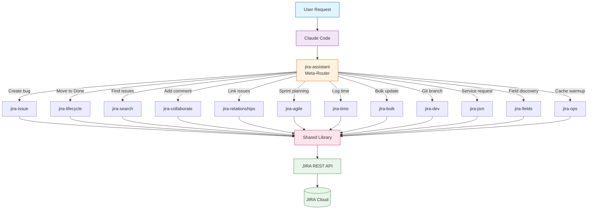
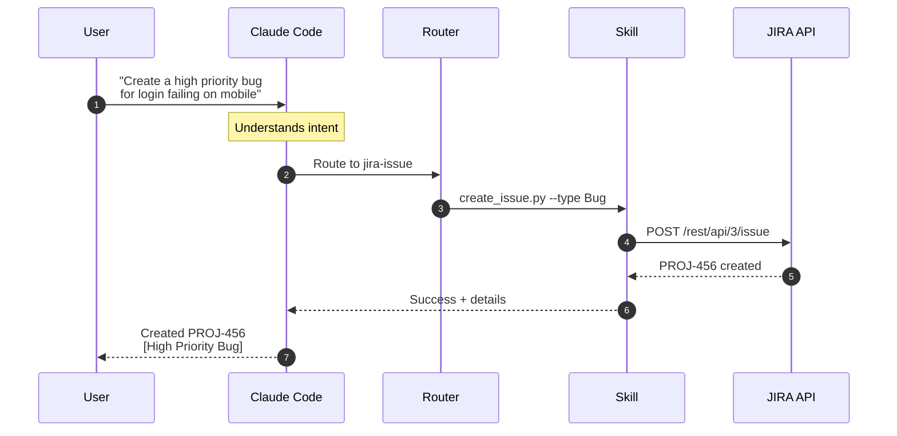

# README Architecture Section

Copy the content below into your main README.md to add the architecture section.

---

## Architecture

### How It Works

The JIRA Assistant routes your natural language requests through specialized skills, each optimized for specific JIRA operations.

### Request Flow Example

See how a natural language request flows through the system:

### Skill Categories

| Category | Skills | Purpose |
|----------|--------|---------|
| **Core** | jira-issue, jira-lifecycle, jira-search | Issue CRUD, workflow transitions, JQL queries |
| **Collaboration** | jira-collaborate, jira-relationships | Comments, attachments, issue links, dependencies |
| **Agile** | jira-agile, jira-time | Sprint planning, epic management, time tracking |
| **Scale** | jira-bulk, jira-dev | Batch operations, Git branch integration |
| **Enterprise** | jira-jsm, jira-fields, jira-ops | Service management, field discovery, caching |

### Shared Infrastructure

All skills share a common library providing:

- **JIRA Client**: HTTP client with retry logic (3 attempts, exponential backoff)
- **Config Manager**: Multi-source configuration (env vars, settings files, profiles)
- **Error Handler**: HTTP status code mapping to actionable error messages
- **Validators**: Input validation for issue keys, URLs, and data formats
- **Formatters**: Table, JSON, and CSV output formatting
