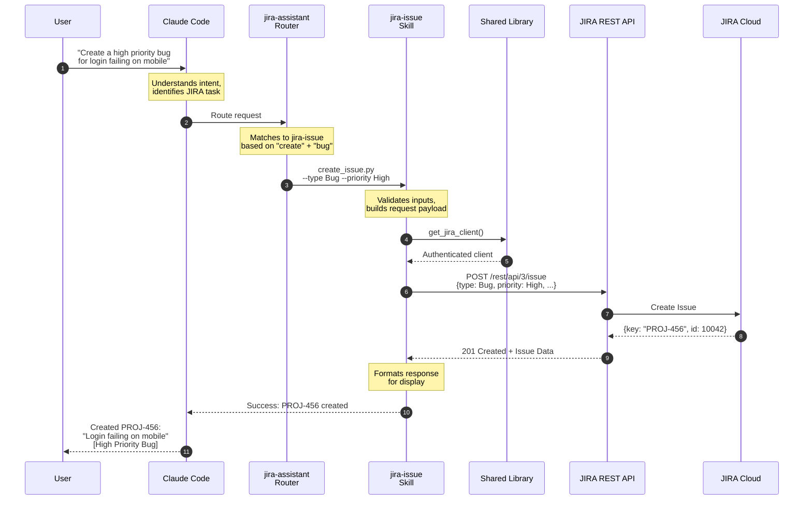
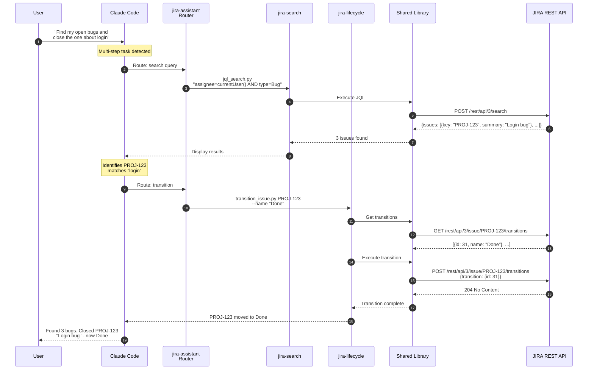
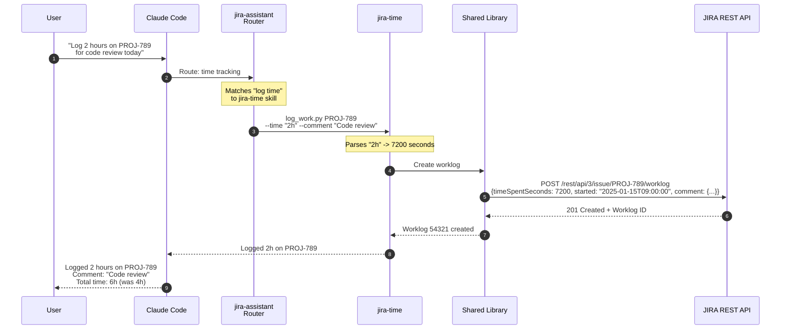

# Request Journey Diagram

## Usage

Embed this sequence diagram in the README to show the step-by-step flow of a user request through the system.

## Mermaid Code - Bug Creation Example

## Mermaid Code - Search and Transition Example

## Mermaid Code - Time Logging Example

## Sequence Diagram Elements

| Element | Purpose |
|---------|---------|
| User | Natural language request |
| Claude Code | AI intent understanding |
| Router | Skill selection based on keywords |
| Skill | Python script execution |
| Shared Library | HTTP client, config, validation |
| JIRA REST API | Atlassian API endpoints |
| JIRA Cloud | Data storage and processing |
