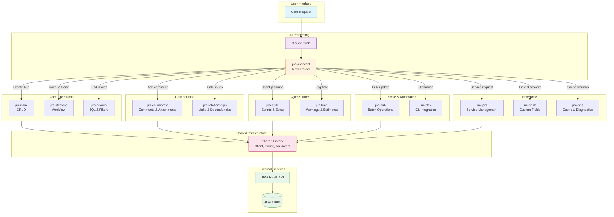
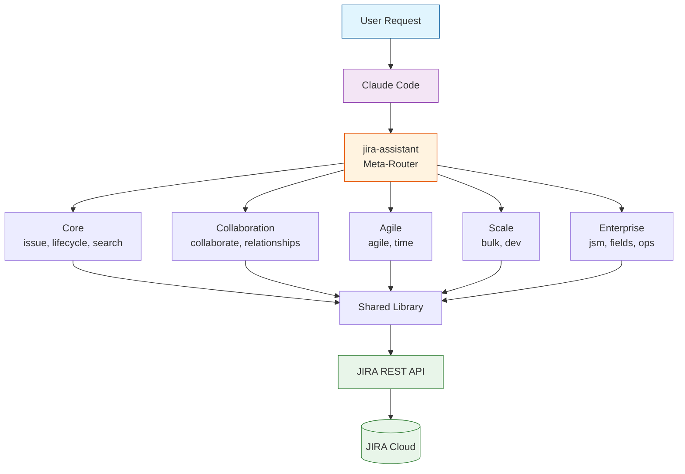

# Skill Router Hub Diagram

## Usage

Embed this diagram in the main README to show how the JIRA Assistant routes requests to specialized skills.

## Mermaid Code

## Compact Version (for narrow displays)

## Skill Categories Reference

| Category | Skills | Purpose |
|----------|--------|---------|
| Core | jira-issue, jira-lifecycle, jira-search | Basic issue operations, workflow, queries |
| Collaboration | jira-collaborate, jira-relationships | Comments, attachments, links, dependencies |
| Agile | jira-agile, jira-time | Sprint planning, time tracking |
| Scale | jira-bulk, jira-dev | Batch operations, Git integration |
| Enterprise | jira-jsm, jira-fields, jira-ops | Service management, field discovery, caching |
