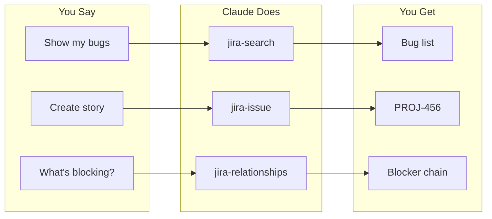
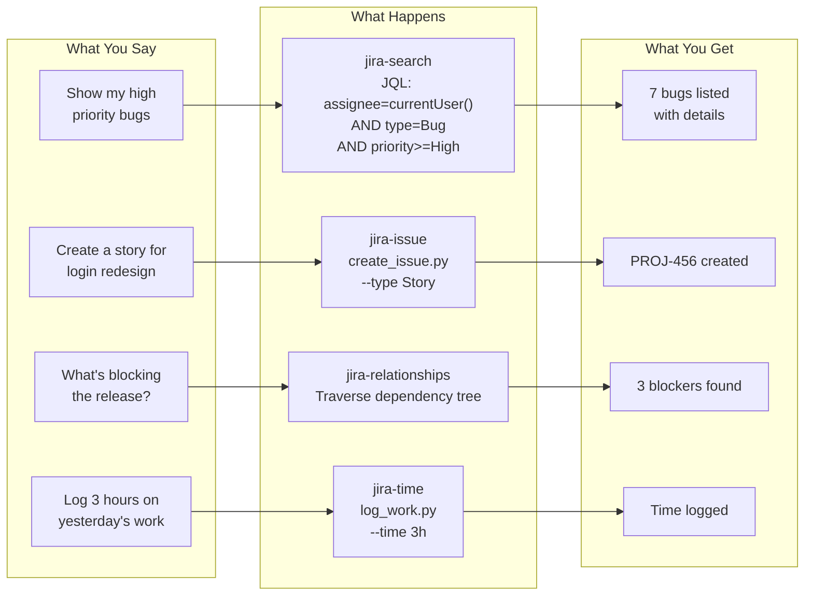
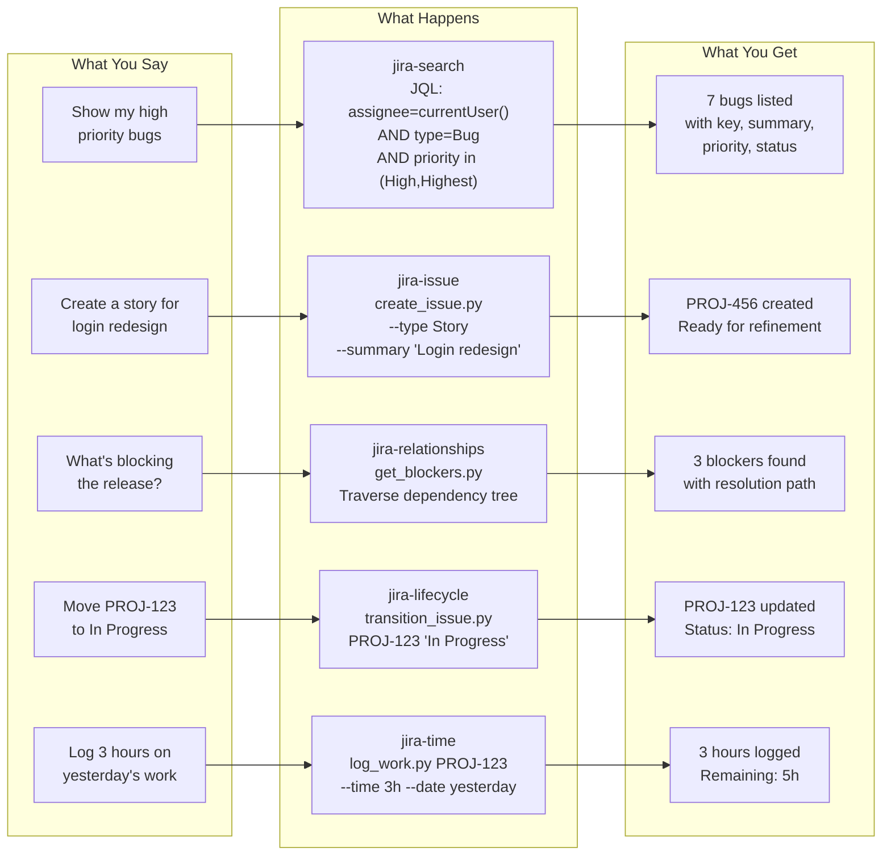

# Use Case Visualizations - README Section

This file contains polished, production-ready content for embedding in the project README.

---

## Option A: Minimal Section (Quick Overview)

### How It Works



---

## Option B: Standard Section (Recommended)

### How It Works

Ask questions in plain English. Get results from JIRA instantly.



### Real-World Example

```
BEFORE: 15 minutes
  1. Open JIRA, find your board
  2. Filter by assignee
  3. Click each issue for details
  4. Copy to meeting notes

AFTER: 45 seconds
  You: "What's my sprint work and yesterday's progress?"

  Claude: Here's your Sprint 42 status:
          - In Progress: PROJ-123, PROJ-124
          - Completed yesterday: PROJ-120, PROJ-121
          - Remaining: 13 story points
          - Velocity: on track
```

---

## Option C: Full Section (Comprehensive)

### How It Works

JIRA Assistant translates natural language into precise JIRA operations:



### Before and After

#### The Monday Standup

```
BEFORE: Sarah's Monday Routine                              15 minutes
------------------------------------------------------------------------
1. Open browser, navigate to JIRA                                 2 min
2. Find the right board among 12 projects                         1 min
3. Filter by assignee (always forgets the syntax)                 3 min
4. Click each issue to check status                               5 min
5. Hunt for sprint velocity report                                2 min
6. Copy issue keys to meeting notes                               2 min

AFTER: With JIRA Assistant                                   45 seconds
------------------------------------------------------------------------
Sarah: "What's my sprint work and what did I complete yesterday?"

Claude: Here's your Sprint 42 status:

        IN PROGRESS
        | PROJ-123  Implement user auth       3 pts   Due: Wed   |
        | PROJ-124  Fix login redirect        2 pts   Due: Thu   |

        COMPLETED YESTERDAY
        | PROJ-120  Add password reset        2 pts   Done       |
        | PROJ-121  Update email templates    1 pts   Done       |

        Sprint Progress: 18/31 points (58%)
        Velocity: On track for completion

TIME SAVED: 14 minutes per standup
```

#### Sprint Planning

```
BEFORE: Manual Sprint Setup                                  90 minutes
------------------------------------------------------------------------
1. Create new sprint in board settings
2. Review and scroll through backlog
3. Drag and drop stories one by one
4. Manually sum story points
5. Check for unestimated stories
6. Assign work to team members
7. Start sprint with goals

AFTER: With JIRA Assistant                                   15 minutes
------------------------------------------------------------------------
SM: "Create Sprint 43 starting Monday for 2 weeks"
    => Sprint 43 created

SM: "Show unestimated stories in the backlog"
    => Found 4 unestimated stories

    [Team estimates in discussion: 10 minutes]

SM: "Move top 12 backlog stories to Sprint 43"
    => Moved 12 stories (34 points)
    => Velocity check: Slightly over average

SM: "Start Sprint 43 with goal 'Complete auth redesign'"
    => Sprint 43 is now ACTIVE

TIME SAVED: 75 minutes per sprint
```

### Annual Impact

| Task | Time Saved | Frequency | Annual Savings |
|------|-----------|-----------|----------------|
| Daily Standup | 14 min | 200/year | 47 hours |
| Sprint Planning | 75 min | 26/year | 32.5 hours |
| Release Prep | 42 min | 12/year | 8.4 hours |
| Incident Response | 11 min | 50/year | 9 hours |
| **Total** | | | **~100 hours/year** |

> That's nearly **13 workdays** returned to productive development work annually per team.

---

## Embedding Instructions

### For GitHub README

Copy any option above directly into your README.md file. The Mermaid diagrams will render automatically on GitHub.

### For Documentation Sites

If using a documentation generator that doesn't support Mermaid natively, you can:

1. **Use Mermaid.live** to generate SVG/PNG images
2. **Add Mermaid plugin** for your static site generator
3. **Use the ASCII versions** in the before-after-stories.md file

### Testing

Preview your README on GitHub to verify Mermaid rendering. GitHub has built-in Mermaid support since February 2022.
