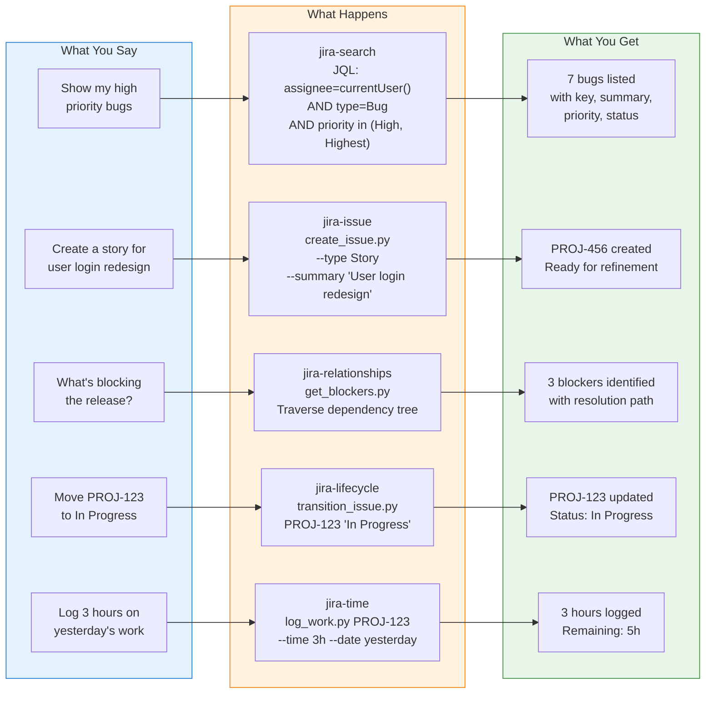
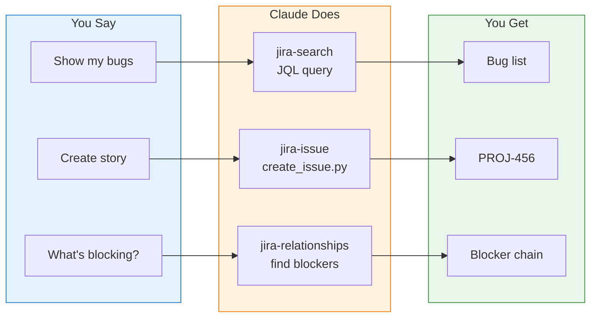
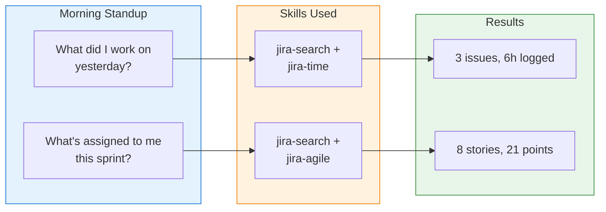
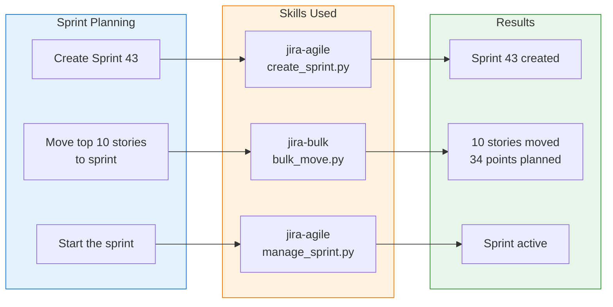

# Command to Result Flow Visualization

This Mermaid diagram demonstrates how natural language requests transform into JIRA actions and meaningful results.

## Primary Flow Diagram

## Compact Version (for README)

## Extended Examples

### Developer Workflow

### Sprint Management

## Skill Quick Reference

| Natural Language | Skill | Script |
|-----------------|-------|--------|
| "Show my bugs" | jira-search | jql_search.py |
| "Create a story" | jira-issue | create_issue.py |
| "Move to Done" | jira-lifecycle | transition_issue.py |
| "What's blocking?" | jira-relationships | get_blockers.py |
| "Log 2 hours" | jira-time | log_work.py |
| "Create sprint" | jira-agile | create_sprint.py |
| "Bulk update" | jira-bulk | bulk_transition.py |
| "Add comment" | jira-collaborate | add_comment.py |
