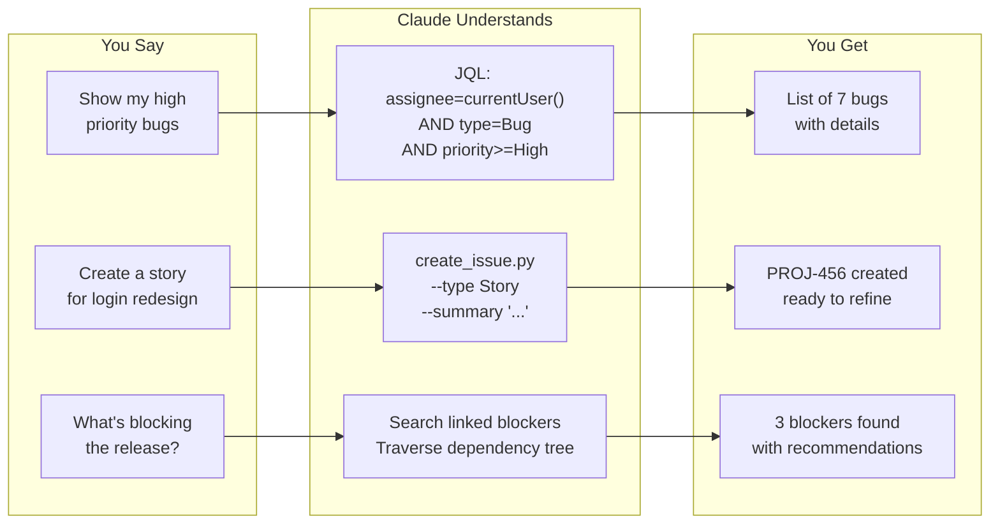
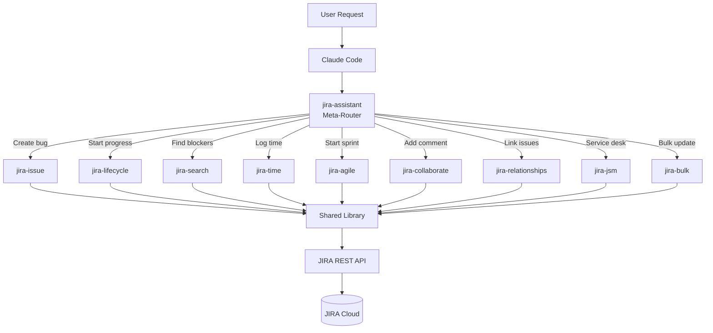

# JIRA Assistant Skills

<!-- ======================================================================
     HERO SECTION (Proposals 01, 02)
     Insert: Banner image, stats, badges, tagline, demo GIF, CTA
     ====================================================================== -->

<!-- BANNER: Proposal 02-2A (Gradient Tech Banner) -->
<p align="center">
  
</p>

<!-- STATS: Proposal 01-F (Stats-Driven Impact) -->
<table align="center">
<tr>
<td align="center">
<h2>10x</h2>
<sub>More context-efficient<br>than MCP servers</sub>
</td>
<td align="center">
<h2>14</h2>
<sub>Specialized skills<br>one conversation</sub>
</td>
<td align="center">
<h2>45s</h2>
<sub>Sprint planning<br>that took 2 hours</sub>
</td>
<td align="center">
<h2>0</h2>
<sub>JQL syntax<br>to memorize</sub>
</td>
</tr>
</table>

<!-- BADGES: Proposal 01-B, 06-6B (Badge Bar) -->
<p align="center">
  <!-- TODO: Update badge URLs with actual repository -->
  
  
  
  
  
  
</p>

<!-- TAGLINE: Proposal 01 -->
<p align="center">
  <strong>Natural language JIRA automation for Claude Code</strong><br>
  <sub>From sprint planning to incident response -- 14 skills, 100+ scripts, zero JQL memorization.</sub>
</p>

<!-- DEMO GIF: Proposal 02-3A, 08-8C -->
<p align="center">
  
</p>

<!-- CTA: Proposal 01-A -->
<p align="center">
  <a href="#quick-start"><strong>Get Started</strong></a> |
  <a href="#demo">Demo</a> |
  <a href="#skills">Skills</a> |
  <a href="#architecture">Architecture</a>
</p>

---

<!-- ======================================================================
     PROBLEM/SOLUTION SECTION (Proposal 05)
     Insert: Side-by-side JQL comparison, time savings
     ====================================================================== -->

## The Problem / Solution

<!-- Proposal 05-5A: Side-by-Side Code Blocks -->
<table>
<tr>
<td width="50%">

### The JQL Way
```jql
project = PROJ AND
status IN ("To Do", "In Progress") AND
assignee = currentUser() AND
sprint IN openSprints() AND
priority IN (High, Highest)
ORDER BY priority DESC, created ASC
```
*Hope you remembered the syntax...*

</td>
<td width="50%">

### The Natural Way
```
"Show my high priority sprint work"
```
*Just ask.*

</td>
</tr>
</table>

<!-- Proposal 05-5B: Task Completion Timeline -->
### Time Saved

| Task | Traditional JIRA | JIRA Assistant | Saved |
|------|------------------|----------------|-------|
| Find my open bugs | 45 seconds | 5 seconds | 89% |
| Create sprint + add stories | 3 minutes | 15 seconds | 92% |
| Log time on 5 issues | 2 minutes | 20 seconds | 83% |
| Check what's blocking release | 5 minutes | 10 seconds | 97% |
| Bulk close 20 resolved issues | 4 minutes | 30 seconds | 88% |

---

<!-- ======================================================================
     QUICK START SECTION
     Insert: 3-step setup guide
     ====================================================================== -->

## Quick Start

### 1. Prerequisites

- Python 3.8+
- Claude Code (Anthropic CLI)
- JIRA Cloud account with API token

### 2. Configure Credentials

```bash
# Set environment variables
export JIRA_API_TOKEN="your-api-token"
export JIRA_EMAIL="your@email.com"
export JIRA_SITE_URL="https://your-company.atlassian.net"
```

### 3. Start Using

```bash
# Just ask Claude
claude "Show me my open issues"
claude "Create a bug: Login button not working"
claude "What's blocking the release?"
```

<p align="center">
  <a href="docs/quick-start.md"><strong>Full Quick Start Guide</strong></a>
</p>

---

<!-- ======================================================================
     WHAT YOU CAN DO SECTION (Proposal 04)
     Insert: Command -> Result flow diagram, use case examples
     ====================================================================== -->

## What You Can Do

<!-- Proposal 04-4I: Command -> Result Flow -->


<!-- Proposal 04-4J: Before/After Narrative -->
<details>
<summary><strong>Example: Sarah's Monday Morning</strong></summary>

**Before JIRA Assistant (15 minutes)**
1. Open browser, navigate to JIRA (2 min)
2. Find the right board (1 min)
3. Set up filters (3 min)
4. Check each issue status (5 min)
5. Look up sprint velocity (2 min)
6. Copy issues to notes (2 min)

**After JIRA Assistant (45 seconds)**
> Sarah: "What's my sprint work and yesterday's progress?"

Claude provides a formatted summary with everything she needs.

**Time saved:** 14 minutes per standup x 250 days = **58 hours/year**

</details>

---

<!-- ======================================================================
     SKILLS OVERVIEW SECTION
     Insert: Table of 14 skills with descriptions
     ====================================================================== -->

## Skills Overview

| Skill | Purpose | Example Command |
|-------|---------|-----------------|
| **jira-assistant** | Meta-skill router | Routes to the right skill |
| **jira-issue** | Issue CRUD | "Create a bug for login failure" |
| **jira-lifecycle** | Workflow transitions | "Move PROJ-123 to In Progress" |
| **jira-search** | JQL & filters | "Show my open issues" |
| **jira-collaborate** | Comments & watchers | "Add comment to PROJ-123" |
| **jira-agile** | Sprints & epics | "Create sprint for next week" |
| **jira-relationships** | Issue linking | "What's blocking PROJ-123?" |
| **jira-time** | Time tracking | "Log 2 hours on PROJ-123" |
| **jira-jsm** | Service desk | "Show my support queue" |
| **jira-bulk** | Bulk operations | "Close all resolved issues" |
| **jira-dev** | Git integration | "Generate branch name for PROJ-123" |
| **jira-fields** | Field discovery | "Show custom fields in PROJ" |
| **jira-ops** | Cache & utilities | "Clear JIRA cache" |
| **jira-admin** | Project admin | "List project permissions" |

---

<!-- ======================================================================
     WHO IS THIS FOR SECTION (Proposal 09)
     Insert: Expandable role-specific sections
     ====================================================================== -->

## Who Is This For?

<!-- Proposal 09-9L: Expandable tabs for roles -->

<details>
<summary><strong>Developers</strong> - Never leave your terminal</summary>

<!-- Proposal 09-9A: Developer README Section -->

**Stop context-switching to JIRA.**

You're in your IDE. You just fixed a bug. Now you need to update JIRA.

```bash
claude "Close PROJ-123 with 'Fixed null pointer', log 30 minutes"
# 3 seconds, never left your terminal
```

### Developer Features
- **Git integration** - Generate branch names, parse commits for issue refs
- **CLI-native** - Works in any terminal, no browser needed
- **IDE agnostic** - VS Code, JetBrains, Vim, whatever you use
- **Profile support** - Switch between dev/staging/prod instances

<!-- Proposal 09-9B: Developer Cheat Sheet -->
### Quick Reference

| Task | Command |
|------|---------|
| Check my work | `"What's assigned to me in the current sprint?"` |
| Start task | `"Start progress on PROJ-123"` |
| Log time | `"Log 2 hours on PROJ-123: Implemented auth fix"` |
| Mark done | `"Close PROJ-123 with resolution Fixed"` |
| Create bug | `"Create bug: Login fails on Safari with error 500"` |
| Get branch name | `"Generate branch name for PROJ-123"` |

</details>

<details>
<summary><strong>Team Leads</strong> - Team visibility in seconds</summary>

<!-- Proposal 09-9D: Team Lead Value Proposition -->

**See your team's work without meetings.**

### Morning Check-in (60 seconds)
```
"Show sprint progress for Team Alpha"
"Who has the most work in progress?"
"What's blocked and why?"
```

### Sprint Planning Support
```
"Show unestimated stories in backlog"
"What's the team velocity for last 3 sprints?"
"Move top 10 priority items to Sprint 42"
```

<!-- Proposal 09-9E: Team Lead Dashboard Queries -->
### Query Templates

**Daily Checks**
- `"Show blockers across all team projects"`
- `"Who's overloaded? Show assignment counts"`
- `"What moved to Done yesterday?"`

**Weekly Reviews**
- `"Sprint burndown for [team]"`
- `"Completed vs planned story points this sprint"`
- `"Issues that have been In Progress > 3 days"`

</details>

<details>
<summary><strong>Scrum Masters</strong> - Run ceremonies, not admin</summary>

<!-- Proposal 09-9F: Scrum Master Workflow -->

**Focus on facilitation, not JIRA navigation.**

### Sprint Planning (Before)
```
"Show prioritized backlog with estimates"
"What dependencies exist in top 20 items?"
"Create Sprint 43 starting next Monday"
```

### Daily Standup (During)
```
"Show yesterday's progress for Sprint 43"
"What's blocked right now?"
"Who has items without updates > 24 hours?"
```

### Sprint Review (After)
```
"Show completed items in Sprint 43 by epic"
"Export sprint results for stakeholder presentation"
"What carried over from last sprint?"
```

**Time saved per sprint: ~3 hours**

</details>

<details>
<summary><strong>Product Managers</strong> - Self-serve product data</summary>

<!-- Proposal 09-9H: Product Manager Features -->

**Focus on product, not project administration.**

### Roadmap Management
```
"Show all epics for Q1 with completion percentage"
"What features shipped last month?"
"Create epic: User Authentication Redesign"
```

### Backlog Grooming
```
"Show stories without acceptance criteria"
"What's been in backlog > 90 days?"
"Prioritize FEAT-123 above FEAT-124"
```

### Stakeholder Communication
```
"Export release notes for v2.1"
"Summarize what's shipping this sprint"
"Show bug fix rate for last quarter"
```

</details>

<details>
<summary><strong>IT/Ops</strong> - Incident response accelerated</summary>

<!-- Proposal 09-9J: IT/Ops Workflow -->

**Incident response without the JIRA dance.**

### Incident Creation
```
"Create urgent incident: Production database unreachable"
```
Creates P1 bug with proper labels, assigns to on-call.

### Incident Management
```
"Show all open incidents by severity"
"Link INCIDENT-123 to root cause INFRA-456"
"Escalate INCIDENT-123 to @platform-team"
```

### Service Desk (JSM)
```
"Show my queue sorted by SLA breach time"
"Resolve REQ-789 with 'Password reset completed'"
"Add customer to watchers on REQ-789"
```

</details>

---

<!-- ======================================================================
     ARCHITECTURE SECTION (Proposal 03)
     Insert: Mermaid architecture diagram
     ====================================================================== -->

## Architecture

<!-- Proposal 03-3B: Skill Router Hub -->


### Technical Highlights

- **Shared Library Pattern** - DRY architecture with common utilities
- **4-Layer Error Handling** - Validation -> API -> Retry -> User messages
- **Profile-Based Config** - Multi-instance support built-in
- **ADF Support** - Native Atlassian Document Format handling
- **Exponential Backoff** - Automatic retry on rate limits

---

<!-- ======================================================================
     TRUST SIGNALS SECTION (Proposal 06)
     Insert: Test coverage, security, documentation
     ====================================================================== -->

## Quality & Security

<!-- Proposal 06-6D: Test Summary Table -->
### Test Coverage

| Category | Tests | Status |
|----------|-------|--------|
| Unit Tests | 195 | Passing |
| Integration Tests | 157 | Passing |
| JSM Tests | 94 | Passing |
| New Skills Tests | 171 | Passing |
| **Total** | **617** | **All Passing** |

*Tests run against live JIRA Cloud instances*

<!-- Proposal 06-6I: Security Badges -->
### Security

- API tokens never stored in code
- HTTPS-only connections enforced
- Input validation on all user data
- No credential logging
- `settings.local.json` gitignored by default

---

<!-- ======================================================================
     DEMO SECTION (Proposal 08)
     Insert: Try it options, Codespaces badge
     ====================================================================== -->

## Try It

<!-- Proposal 08-8D: Codespaces, 08-8A: asciinema -->

[](https://codespaces.new/grandcamel/jira-assistant-skills)

**No JIRA account?** Watch the [interactive demo](https://grandcamel.github.io/jira-assistant-skills/demo) with sample data.

---

<!-- ======================================================================
     DOCUMENTATION SECTION (Proposal 06-6H)
     Insert: Help links
     ====================================================================== -->

## Documentation

<!-- Proposal 06-6H: Help Available Indicators -->

- [Full Documentation](./docs/)
- [Quick Start Guide](./docs/quick-start.md)
- [Configuration Guide](./docs/configuration.md)
- [Troubleshooting](./docs/troubleshooting.md)
- [API Reference](./docs/api-reference.md)

### Need Help?

- [GitHub Discussions](https://github.com/grandcamel/jira-assistant-skills/discussions)
- [Report Issues](https://github.com/grandcamel/jira-assistant-skills/issues)

---

<!-- ======================================================================
     CONTRIBUTING SECTION
     ====================================================================== -->

## Contributing

Contributions are welcome! Please read our [Contributing Guide](./CONTRIBUTING.md) before submitting a pull request.

### Development Setup

```bash
# Clone the repository
git clone https://github.com/grandcamel/jira-assistant-skills.git
cd jira-assistant-skills

# Install dependencies
pip install -r .claude/skills/shared/scripts/lib/requirements.txt

# Run tests
pytest .claude/skills/*/tests/ -v
```

---

<!-- ======================================================================
     ROADMAP SECTION (Proposal 06-6O)
     ====================================================================== -->

## Roadmap

<!-- Proposal 06-6O: Roadmap Visibility -->

- [x] Core JIRA operations (v1.0)
- [x] Agile workflow support (v1.1)
- [x] Service Management (v1.2)
- [x] Bulk operations (v1.3)
- [ ] GitHub integration enhancements
- [ ] Slack notifications
- [ ] Custom workflow templates

[View full roadmap](./ROADMAP.md)

---

<!-- ======================================================================
     LICENSE SECTION
     ====================================================================== -->

## License

This project is licensed under the MIT License - see the [LICENSE](./LICENSE) file for details.

---

<!-- ======================================================================
     FOOTER
     ====================================================================== -->

<p align="center">
  Made with care for the JIRA-weary
</p>

<!-- ======================================================================
     TEMPLATE NOTES (DELETE BEFORE PUBLISHING)

     This template incorporates elements from all 9 proposals:

     - Proposal 01: Hero section options (01-F stats, 01-B badges, 01-D demo)
     - Proposal 02: Visual assets (02-2A banner, 02-3A demo GIF)
     - Proposal 03: Architecture diagrams (03-3B skill router hub)
     - Proposal 04: Use case visualizations (04-4I command flow, 04-4J narrative)
     - Proposal 05: Comparison content (05-5A side-by-side, 05-5B time table)
     - Proposal 06: Trust signals (06-6D tests, 06-6H docs, 06-6I security, 06-6O roadmap)
     - Proposal 07: Video content (referenced in demo section)
     - Proposal 08: Interactive demos (08-8A asciinema, 08-8D codespaces)
     - Proposal 09: Audience content (09-9A developer, 09-9D team lead, 09-9L tabs)

     Placeholders to update:
     - [ ] assets/banner.png - Create using BANNER_SPEC.md
     - [ ] assets/demo.gif - Generate using demo.tape
     - [ ] Repository URLs - Update grandcamel/jira-assistant-skills
     - [ ] Badge URLs - Update with actual repository
     - [ ] Codespaces badge URL - Update with actual repository
     - [ ] GitHub Pages URLs - Update with actual domain

     ====================================================================== -->
